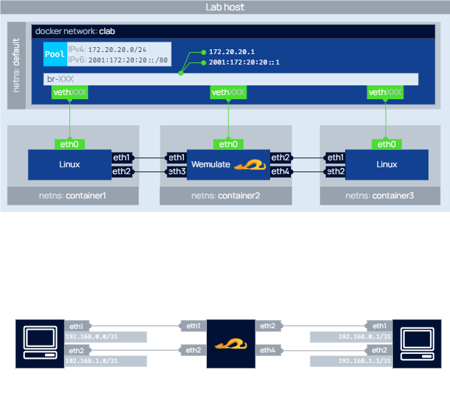

# WEmulate Containerlab Demo

This is a simple setup for Containerlab setup to try out the WEmulate container.


> ⚠️ WSL2 does not support traffic control (TC)


## Topology



## Start

```bash
sudo containerlab deploy -t wemulate.clab.yml
```


## Stop

```bash
sudo containerlab destroy
```
